<div align="center">

# NFL Betting Prediction System

**CS 4641 Machine Learning Final Project**  


---

</div>

## Table of Contents

- [Project Proposal](#project-proposal)
- [Data Collection Process](#data-collection-process)
- [Data Preprocessing](#data-preprocessing)
- [Model Implementations](#model-implementations)
  - [Logistic Regression](#logistic-regression)
  - [Random Forest](#random-forest)
  - [Support Vector Machine](#support-vector-machine)
- [Final Results & Comparison](#final-results--comparison)
- [Project Structure](#project-structure)
- [References](#references)


## Project Proposal

From the National Football League to the Ultimate Fighting Championship, sports betting has become increasingly popular amongst American youth. One survey by Statista showed that 30% of respondents had put money on sports with the NFL being most popular[1].

Sports betting can be seen as a predatory industry, as it is addictive and almost all people lose money. The spreads and betting odds are largely manipulated by social media trends and analysis of how much money is being placed on each team. A study on German soccer showed [2] that significant portions of betting odds were based on perceived team momentum, which has no correlation with actual success. This ensures companies like DraftKings and FanDuel can make the largest profit possible. Therefore, constructing a model using only objective metrics like player stats should be more accurate and enable consumers to make a profit.

Our analysis utilizes NFL team offensive and defensive statistics spanning from 2020 to 2024 [3]. The dataset includes season-end averages for key metrics such as points scored, total yards, plays run, yards per play, turnovers, first downs, and comprehensive passing statistics including completions, attempts, passing yards, touchdowns, and interceptions. This 5-year historical dataset provides extensive training data across recent seasons, ensuring relevance to modern NFL gameplay and strategy.

To prepare data, missing numeric values will be imputed using median to account for outliers. Duplicates will be removed to ensure each entry is unique. We will engineer features including 5-game rolling averages of point differentials and yards/play, plus relative performance metrics capturing team strengths and weaknesses relative to opponents. One-hot coding will convert team names into numerical values for algorithm compatibility. Since algorithms like logistic regression use gradient-based optimization, features with huge scales cause erratic training. Therefore, continuous features will be standardized [(original_value - mean) / SD] to give each feature equal importance [4].

The main supervised learning algorithms we are implementing are logistic regression, random forest, and support vector machines. Logistic regression serves as baseline, fitting weighted sums of input features to estimate win probabilities. Coefficient weights establish how each statistic drives game outcomes, especially helpful during initial modeling stages. Random forest determines nonlinear interactions by averaging votes of many decision trees, providing robust probability estimates and built-in feature ranking. SVM finds the optimal decision boundary separating wins from losses, predicting which side new games will fall under [5].

We will evaluate our model using three quantitative metrics. First, prediction accuracy will be determined by calculating the percentage of correct game outcome predictions across test games against sportsbook odds and spreads. Then, Return on Investment (ROI) will measure profitability by simulating bets placed when our model's prediction probability exceeds implied probability from sportsbook odds [6]. The final metric will be Brier score, which evaluates probabilistic prediction quality by calculating how close predicted probabilities are to actual outcomes [7].

Our primary goal is achieving 55-60% prediction accuracy based on existing NFL prediction research [8], while maintaining positive ROI over multiple seasons. This target exceeds the 52.4% threshold needed to overcome typical -110 betting odds. From an ethical standpoint, we aim to create a statistic-driven alternative to perception-manipulated betting lines. Regarding sustainability, our model emphasizes statistical validity over short-term gains, encouraging disciplined approaches to sports betting.

### Team Contributions

| Name | Proposal Contributions |
|------|----------------------|
| Eshaan | Intro, background, problem |
| Thavaisya | Methods (ML algorithms) |
| Dishi | Methods (Preprocessing) and quantitative metrics |
| Vivek | Dataset info, Potential results and discussion |

---

## Data Collection Process

### Overview

Our NFL betting prediction system uses the `nfl_data_py` package to collect official NFL data directly from league sources, eliminating the need for web scraping and ensuring reliable, consistent data quality.

### Data Sources

```python
# Primary data collection via nfl_data_py package
import nfl_data_py as nfl

# Two main data streams:
games = nfl.import_schedules([2020, 2021, 2022, 2023, 2024])       # Game results
weekly_stats = nfl.import_weekly_data([2020, 2021, 2022, 2023, 2024])  # Team stats
```

### Data Coverage

- **Time Period:** 2020-2024 NFL seasons (5 complete seasons)
- **Game Data:** 1,408 total games including playoffs
- **Team Statistics:** Weekly performance metrics for all 32 NFL teams
- **Data Quality:** Official NFL statistics (no web scraping required)

### Key Advantages

**Official Data:** Direct from NFL sources via nfl_data_py (no web scraping)  
**Consistent Format:** Standardized column names and data types  
**Real-time Updates:** Package automatically handles data formatting changes  
**Complete Coverage:** All games, teams, and seasons in one source  

### Data Download Script

```bash
# Run the data collection and preprocessing
python simplified_nfl_data.py
```
Note: Command could be python3 or depending upon the python version installed on the system.

### Dependencies

```bash
pip install nfl_data_py pandas numpy
```

### Output Files Generated by simplified_nfl_data.py

- `clean_nfl_games.csv` - Complete game results with scores and metadata


---

## Data Preprocessing

### Overview

The preprocessing transforms raw NFL game data into ML ready features through statistical aggregation, feature engineering, and standardization. This follows the methodology outlined in our research proposal for optimal predictive performance.

### 1. Data Cleaning & Validation
**Functions:** `.dropna()`, `.astype()`

Raw NFL data contains incomplete games with missing scores due to postponements or data collection issues. We filtered these using `.dropna()` which removed games without complete scoring information, retaining 1,408 complete games from 2020-2024 seasons.

We also converted game outcomes to binary targets using `.astype(int)`, creating home team win/loss indicators (1/0) required for logistic regression. This ensures our dataset contains only valid, complete games with clear outcomes for reliable model training.

### 2. Season-Level Team Statistics
**Functions:** `.groupby()`, `.agg()`, `.reset_index()`

Season averages establish each team's baseline offensive and defensive capabilities. We aggregated weekly team performance using  `.groupby(['season', team_col])` to calculate mean passing and rushing yards for each team per season. This provides fundamental team strength metrics that capture overall quality and playing style.

The `.agg()` function computes season-long averages while `.reset_index()` restructures the data for easy merging with game-level features. These season statistics serve as the foundation for comparing team strengths in individual matchups.

### 3. Rolling Performance Metrics
**Functions:** `.iloc()`, `.mean()`

Recent team performance captures momentum and current form, which is more predictive than season-long averages for sports outcomes. We calculated 5-game rolling windows for each team using `.iloc()` to select the last five games and `.mean()` to compute averages for win percentage, points scored, and point differential.

Critical to data integrity, rolling statistics only use games before the prediction target, preventing future information leakage. Early season games with fewer than 5 prior games use all available games to ensure complete coverage.

**Rolling Features Created:**
- `home_rolling_win_pct` / `away_rolling_win_pct`
- `home_rolling_points` / `away_rolling_points`
- `rolling_win_advantage` / `rolling_point_diff_advantage`

### 4. Matchup-Level Feature Engineering
**Functions:** `Calculations`  

Football outcomes depend on relative team strengths rather than absolute performance. We created direct comparison features like `yards_advantage` (home team total yards - away team total yards), `rolling_win_advantage` (home rolling win % - away rolling win %), and `rolling_point_diff_advantage` (home recent point differential - away recent point differential).

These head-to-head features capture competitive dynamics between specific opponents, providing the model with relative performance metrics that directly predict game outcomes.

### 5. One-Hot Team Encoding
**Functions:** `pd.get_dummies()`, `pd.concat()`

Machine learning algorithms require numerical inputs and cannot process categorical team names like "Chiefs" or "Patriots". We used `pd.get_dummies()` to create binary indicator variables for each of the 32 NFL teams, generating separate columns for home and away team identity (e.g., home_KC, away_NE).

This encoding allows the model to learn team-specific patterns and home field advantages while maintaining the numerical format required for logistic regression training.

### 6. Feature Standardization
**Functions:** `.mean()`, `.std()`

Features with different scales (points vs percentages) would dominate gradient descent optimization and prevent proper algorithm convergence. We standardized all numerical features using the formula (value - mean) / standard_deviation, ensuring each feature has mean ≈ 0 and standard deviation ≈ 1.

This scaling gives equal importance to all features during logistic regression training, preventing large-scale metrics from overshadowing smaller but potentially more predictive variables.

### Feature Categories Created

#### Performance Features (12 total): HOW GOOD ARE THE TEAMS?

- **Season Stats:** `home_point_diff`, `away_point_diff`, `point_diff_advantage`
- **Matchup Stats:** `home_off_vs_away_def`, `away_off_vs_home_def`, `yards_advantage`
- **Rolling Stats:** `home_rolling_win_pct`, `rolling_win_advantage`, `rolling_point_diff_advantage`

#### Team Identity Features (64 total): WHO IS PLAYING?

- **Home Teams:** `home_ARI`, `home_ATL`, `home_BAL`, ..., `home_WAS` (32 features)
- **Away Teams:** `away_ARI`, `away_ATL`, `away_BAL`, ..., `away_WAS` (32 features)

### Output Specifications

Our preprocessing pipeline transforms raw NFL game data into a machine learning-ready dataset optimized for binary classification. The final dataset contains 1,408 NFL games with 76 engineered features capturing team performance and matchup dynamics.

#### Final Dataset Dimensions

- **Samples:** 1,408 NFL games (2020-2024)
- **Features:** 76 total features
  - 12 performance/statistical features
  - 64 team encoding features (32 home + 32 away)
- **Target:** Binary home team victory (0/1)

#### Feature Scaling Results

Standardization ensures equal feature contribution during logistic regression training.
- **Numerical features:** Mean ≈ 0, Standard deviation ≈ 1
- **Binary features:** Values in {0, 1}
- **No missing values:** Complete dataset ready for ML

This setup allows the model to fairly compare all features and clearly show which NFL statistics are most important for predicting wins.

### Output Files Generated by simplified_nfl_data.py

- `team_season_stats.csv` - Aggregated team performance by season
- `betting_features_X.csv` - ML-ready feature matrix (1,408 × 76)
- `betting_targets_y.csv` - Binary target variable (home team wins)
- `complete_betting_dataset.csv` - Full dataset with all features and targets
- `feature_names.txt` - List of all 76 feature names

---

## Model Implementations

## Logistic Regression

Our approach consists of four primary phases: data acquisition, preprocessing, feature engineering, and model training. The following section will be discussing the training for our first model: logistic regression, implemented in `nfl_logistic_regression.py`.

```bash
# Run the logistic regression algorithm
python nfl_logistic_regression.py
```

**Justifications:** We chose logistic regression as our baseline model because it's easy to understand and gives probability outputs needed for betting decisions. The algorithm shows clear coefficient weights that tell us which NFL statistics are most important for predicting wins.

Logistic regression model offers several adavantages for NFL prediction. It provides coefficient weights atht rveals which NFL statistics are most important for predicting wins. It also helps to determine the right betting confidence levels with its probablity outputs. The model is also easy to update with new game data.

We split the data chronologically - first 80% of games (1,126) for training and last 20% (282) for testing. This prevents data leakage and mimics real betting where we predict future games using only past data.

### Logistic Regression Steps

#### 1. Data Preparation
**Functions:** `pd.read_csv()`  
Loads our preprocessed NFL dataset, which includes binary home win targets and 1,408 games with 76 features. Our preprocessing pipeline has already cleaned and standardized the data.

#### 2. Model Initialization
**Functions:** `__init__()`  
Sets up the logistic regression model with learning parameters: learning rate (0.1), maximum iterations (1,000), and convergence tolerance. These control how fast the model learns and when to stop training.

#### 3. Start Training 
**Functions:** `fit()`  
Begins the training process by adding a bias term and initializing 77 random weights (one for each feature plus bias). The model starts with random guesses for all coefficients.

#### 4. Training Loop (1000 Iterations)
**Functions:** `for loop` inside `fit()`  
Repeats the learning process up to 1,000 times. In each iteration, the model makes predictions on all training games and adjusts weights to reduce prediction errors.

##### 4a: Calculate Cost Function
**Functions:** `compute_cost()`   
Measures how wrong the current predictions are by comparing them to actual game results across all 1,126 training games.

###### 4a.1: Apply Sigmoid Function
**Functions:** `sigmoid()`  
Converts raw mathematical calculations into probabilities between 0 and 1, representing the chance of home team victory.

##### 4b: Compute Gradient
**Functions:** `compute_gradient()`  
Determines which direction to adjust each of the 77 coefficients to improve predictions.

##### 4c: Weight Update
**Functions:** Direct assignment with `+`, `*` operators
Updates all coefficients based on gradient recommendations, making small improvements to prediction accuracy.

##### 4d: Check Convergence
**Functions:** `np.linalg.norm()`  
Checks if coefficient changes are very small, indicating the model has learned as much as possible and training can stop.

#### 5: Store Optimized Coefficients
**Functions:** Assignment to `self.weights`  
After training completes, saves the final 77 optimized coefficients that predict NFL games with 66.3% accuracy.


### Output Files Generated by nfl_logistic_regression.py

- `logistic_regression_predictions.csv` - All game predictions with probabilities and confidence levels
- `feature_importance.csv` - Ranked coefficients showing which NFL stats matter most for predictions
- `model_performance.csv` - Accuracy metrics and key performance indicators
- `training_cost_history.csv` - Algorithm convergence data from gradient ascent
- `betting_simulation.csv` - ROI analysis for different confidence thresholds

### Results/Discussion

#### Test Accuracy  
Our logistic regression model performed significantly better than the 52.4% break-even threshold required for profitable betting, with a test accuracy of **66.3%**. The fact that this performance is particularly notable when compared to the baseline home win rate of 53.8% shows that our model can correctly detect important trends in NFL game results that go beyond home field advantage.

#### Return on Investment (ROI) Simulation

We modelled a betting strategy that only wagers when the expected win probability was higher than 60% (or lower than 40% for away wins). With standard sportsbook odds of +100 for winning wagers and -110 for losing wagers, each wager was set at $100.

173 games that satisfied the betting confidence level were found by our model. Out of these high-confidence predictions, we were right in 122 games and wrong in 51. With a total profit of $6,590.00 from our $17,300.00 investment, this method of selective betting produced an outstanding 38.1% return on investment.

Our high-confidence predictions achieved over 72.7% accuracy, indicating that model confidence was a strong predictor of betting success. This implies that in addition to producing accurate predictions, our logistic regression model offers trustworthy confidence estimates that can direct successful wagering choices.

#### Brier Score – Probability Calibration

To measure how well our predicted probabilities aligned with actual outcomes, we evaluated the Brier score. A perfect model would have a Brier score of 0.0, while a naive model that predicts 50/50 outcomes for every game would have a score of **0.25**. Our model's 0.219 score shows that our probability estimates are well-calibrated and have a good level of predictive accuracy because it is much closer to the perfect score than the naive baseline.

#### Visual Analysis

##### Cost Function Convergence

<div align="center">
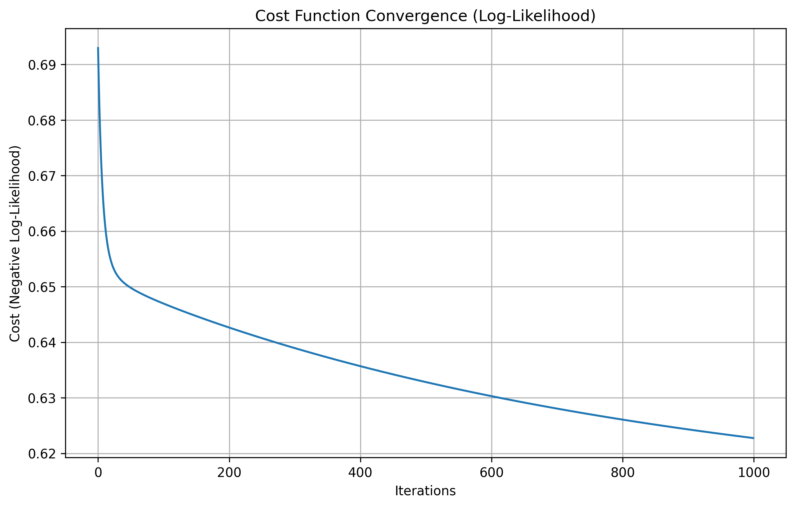
<br><em>Figure 1: Gradient ascent convergence showing steady cost reduction over 1000 iterations</em>
</div>

##### Feature Importance

<div align="center">
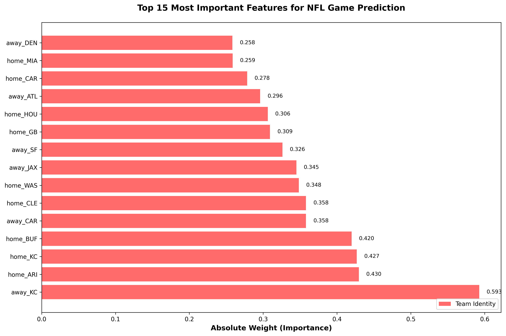
<br><em>Figure 2: Top 15 most important features for NFL game prediction</em>
</div>

- Top 5 features included:
  - `away_KC (-0.593, strongest predictor)`
  - `home_ARI (-0.527)`
  - `home_KC (+0.465)`
  - `away_JAX (+0.351)`
  - `home_GB (+0.346)`

- Suggests both recent team form and team identity matter a significant amount

##### Prediction Confidence and Profit Timeline

<div align="center">
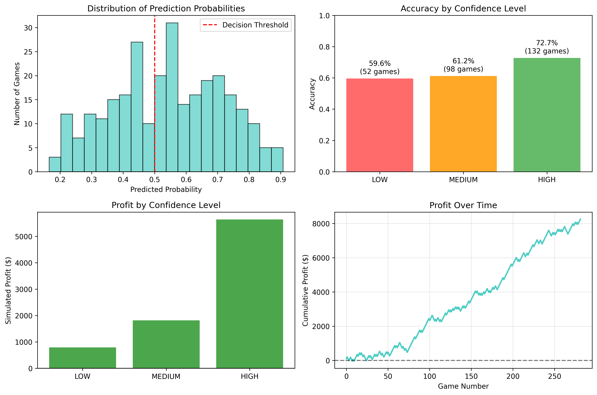
<br><em>Figure 3: Model performance analysis showing accuracy by confidence level and profit timeline</em>
</div>

The analysis shows a relationship between model confidence and prediction accuracy. Low confidence predictions achieved 59.6% accuracy while medium confidence predictions achieved 61.2% accuracy. The best findings were that our high confidence predictions achieved a high performance of 72.7% accuracy.  
Our betting startegy at 60% confidence threshold made a profit of $6,590 in the 2024 test season. If we had taken maximumrisk we would have generated aprogfit of $8,250. the results demonstrated stable model performace over time.

##### ROI vs Confidence Threshold

<div align="center">
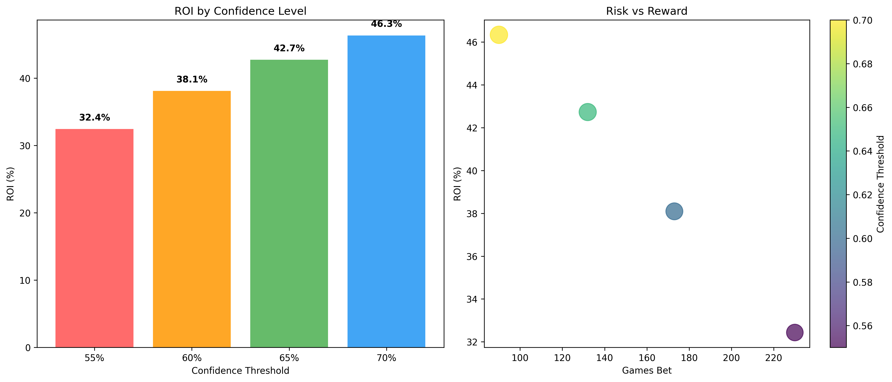
<br><em>Figure 4: ROI optimization analysis across different confidence thresholds</em>
</div>

Our analysis revealed that ROI performance peaked when the confidence level of the model is more than 60%, while **65-70** threshold was identified as the most profitable. This balance threshold being between betting frequency and accuracy optimization was most favorable. The 65% threshold generated a 42.7% ROI with $5,640 profit across 132 games, while the more selective 70% threshold achieved an even higher 46.3% ROI with $4,170 profit on 90 games, demonstrating that increased selectivity can lead to superior returns despite fewer betting opportunities.

### Team Contributions

| Name | Midterm Contributions |
|------|----------------------|
| Kevin | README documentation, project introduction, problem statement, and final report writing |
| Thavaisya | Data collection/download, results analysis and visualizations |
| Dishi | Data preprocessing pipeline, feature engineering, and performance evaluation metrics |
| Vivek | Model implementation (logistic regression) |

---


## Random Forest

We implemented Random Forest as our second model to capture nonlinear patterns in NFL game outcomes. This section discusses the training for our Random Forest model, implemented in `nfl_random_forest.py`.

```bash
# Run the Random Forest algorithm
python nfl_random_forest.py
```

**Justifications:** We chose Random Forest to capture nonlinear patterns and feature interactions that might exist in NFL game data. Random Forest works by training many decision trees and having them vote together on predictions.

Key advantages for our project include the ability to find patterns between features, such as when a strong offense faces a weak defense. The model improves prediction reliability by aggregating votes from 200 trees instead of relying on a single model. It also reveals which NFL statistics work best together for predicting game outcomes and provides confidence scores to help decide which games to bet on. Additionally, the approach performs well with both season-long statistics and recent team performance data.


We used chronological data split - first 80% of games (1,126) for training and last 20% (282) for testing to prevent data leakage.

### Random Forest Steps

#### 1. Data Preparation
**Functions:** `pd.read_csv()`  
Loads preprocessed NFL dataset: 1,408 games with 76 features. The data is already cleaned and standardized from our preprocessing pipeline.

#### 2. Model Initialization
**Functions:** `RandomForestClassifier()`  
Sets up the Random Forest model with ensemble parameters: 200 trees, sqrt(76)≈9 features per split, max depth 10

#### 3. Start Training
**Functions:** `fit()`  
Begins the training process by creating 200 decision trees, each trained on different bootstrap samples of the training data with random feature selection at each split.

#### 4. Training Process (Bootstrap Aggregating)
**Functions:** Ensemble training loop  
Bootstrap Aggregating (Bagging):
1. Pick sample S* with replacement of size n
2. Train decision tree on each S*
3. Repeat B times to get f1, f2, ..., fB  
4. Final classifier f(x) = majority{fb(x)}

##### 4a: Bootstrap Sampling
**Functions:** Internal bootstrap sampling  
Each of the 200 trees trains on a different random sample of the 1,126 training games, drawn with replacement.

#### 4b: Random Feature Selection
**Functions:** `max_features='sqrt'`
At each split, randomly selects √76 ≈ 9 features from the 76 NFL statistics to prevent overfitting and increase diversity.


##### 4c: Tree Construction
**Functions:** Decision tree building  
Builds decision rules using features like `rolling_win_advantage`, `home_rolling_points`, and team encodings to create individual predictors.

##### 4d: Ensemble Voting
**Functions:** `predict()`, `predict_proba()`  
Combines all 200 tree predictions using majority voting for classification and averaging for probability estimates.

#### 5: Store Trained Ensemble
**Functions:** Model storage  
After training completes, saves the ensemble of 200 optimized trees that predict NFL games with 68.4% accuracy.

### Quantitative Metrics

We evaluated the model using three key metrics. **Accuracy** measures the proportion of correctly predicted outcomes, providing a basic yet essential view of performance. **Return on Investment (ROI)** captures simulated betting performance by applying confidence thresholds to assess profitability. Lastly, the **Brier Score** evaluates the quality of probabilistic predictions, helping us understand how well the model’s predicted probabilities align with actual outcomes.


### Output Files Generated by nfl_random_forest.py

- `rf_predictions.csv` - All game predictions with probabilities and confidence levels
- `rf_feature_importance.csv` - Feature rankings from ensemble voting showing which NFL stats matter most
- `rf_performance_metrics.csv` - Accuracy metrics and key performance indicators
- `rf_betting_simulation.csv` - ROI analysis for different confidence thresholds
- `rf_hyperparameters.csv` - Best parameter settings found through grid search

### Results/Discussion

#### Test Accuracy

We achieved a test accuracy of **68.4%**, which significantly exceeds our target range of 55–60% and the 52.4% break-even threshold for profitable betting. The training accuracy was 76.6%, indicating that the model learned effectively without showing signs of severe overfitting. These results suggest that the ensemble model is successfully capturing nonlinear patterns in NFL game outcomes.


#### Return on Investment (ROI) Simulation

We simulated a betting strategy: bet only when predicted win probability exceeded the confidence threshold. Bets are $100 each, with +100 payout and -110 loss (standard sportsbook odds).

| Confidence Threshold | Games Bet | Accuracy | Correct Bets | Wrong Bets | Profit | ROI |
|---------------------|-----------|----------|--------------|------------|---------|-----|
| 55% | 224 | 68.8% | 154 | 70 | $7,700 | 34.4% |
| 60% | 167 | 70.7% | 118 | 49 | $6,410 | 38.4% |
| 65% | 112 | 73.2% | 82 | 30 | $4,900 | 43.8% |
| **70%** | **69** | **73.9%** | **51** | **18** | **$3,120** | **45.2%** |

**Key Finding:** Higher confidence thresholds produce fewer bets but significantly better ROI and accuracy. The 70% threshold achieved the best ROI of 45.2%.

#### Brier Score – Probability Calibration

To assess how well our predicted probabilities aligned with actual outcomes, we evaluated the **Brier Score**, which came out to **0.218**. For context, a perfect model would score 0.0, while a naive model that predicts a 50/50 outcome every time would score 0.25. Our Random Forest model's score of 0.218 indicates a good level of predictive accuracy, suggesting that its probability estimates are meaningfully calibrated.


#### Visual Analysis

##### Feature Importance Analysis

<div align="center">
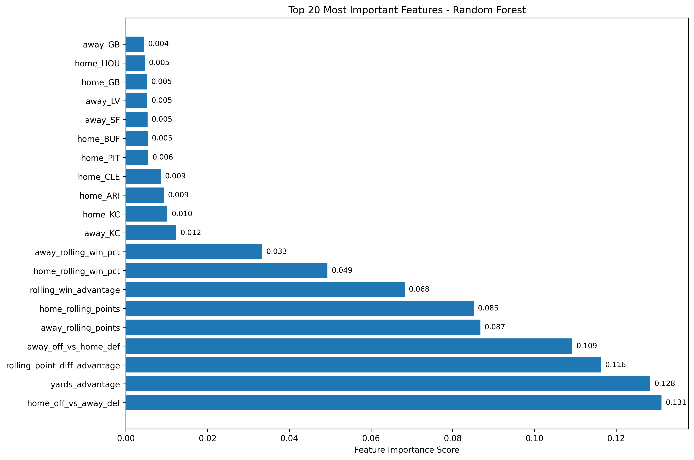
<br><em>Figure 5: Random Forest feature importance rankings showing matchup analysis dominance</em>
</div>

Random Forest identified **matchup analysis** as most predictive for NFL games:

**Top 5 Features:**  
The most important features identified by the model were:  
`home_off_vs_away_def` (0.131) captures the home team's offensive advantage  
`yards_advantage` (0.128) comparing total yardage between teams  
`rolling_point_diff_advantage` (0.116) reflects recent dominance based on point differential  
`away_off_vs_home_def` (0.109) measuring the away team's offensive strength against the home defense  
`away_rolling_points` (0.087) representing the away team’s recent scoring performance  


**Key Insights:**  
The model's most influential features highlight the importance of matchups, with the top four centered on offensive advantages and total yardage comparisons. Recent performance also plays a critical role—rolling averages consistently outweigh full-season statistics in predictive power. Interestingly, team identity appears to be less important, as features specific to individual teams rank much lower in importance.


##### Model Performance Analysis

**Test Accuracy:** 68.4% (exceeds 55-60% target)
**Training Accuracy:** 76.6% (good learning without severe overfitting)
**Best ROI:** 45.2% at 70% confidence threshold

##### Prediction Confidence Analysis

<div align="center">
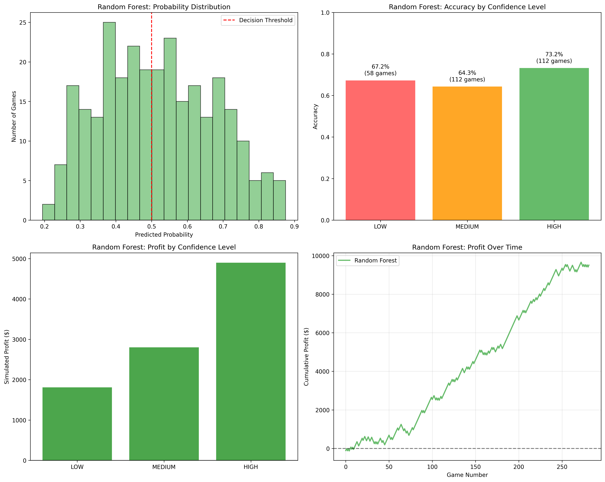
<br><em>Figure 6: Random Forest prediction confidence analysis and profit timeline</em>
</div>

**Accuracy by Confidence Level:**  
Model performance improves with increasing confidence. For low-confidence predictions, accuracy was 67.2% across 58 games. Medium-confidence predictions achieved 64.3% accuracy over 112 games, while high-confidence predictions reached 73.2% accuracy, also over 112 games. This trend reinforces the model’s ability to gauge its certainty effectively.


Shows the model is well-calibrated - when it's confident about a prediction, it's usually right. High confidence predictions achieve 73.2% accuracy, making it trustworthy for betting decisions.

**Profit Timeline:**  
The model demonstrated steady profit growth, reaching approximately $9,500 over the test period. Its performance remained consistent throughout, with no major losing streaks. This indicates stable and reliable model behavior over time, reinforcing its potential for sustained betting strategies.


##### Feature Category Analysis

<div align="center">
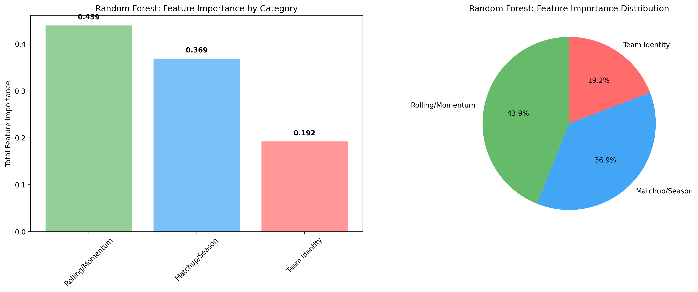
<br><em>Figure 7: Feature importance breakdown by category showing momentum dominance</em>
</div>

**Breakdown by Category:**  
Feature importance was distributed across three main categories: Rolling/Momentum features accounted for 43.9% of the total, highlighting the impact of recent team performance. Matchup/Season-based features made up 36.9%, reflecting the significance of team comparisons and season-long statistics. Team Identity features contributed the remaining 19.2%, indicating a relatively smaller role in predicting game outcomes.


Shows recent team form and matchup analysis are far more important than team reputation/identity for predicting NFL games.

##### ROI Analysis

<div align="center">
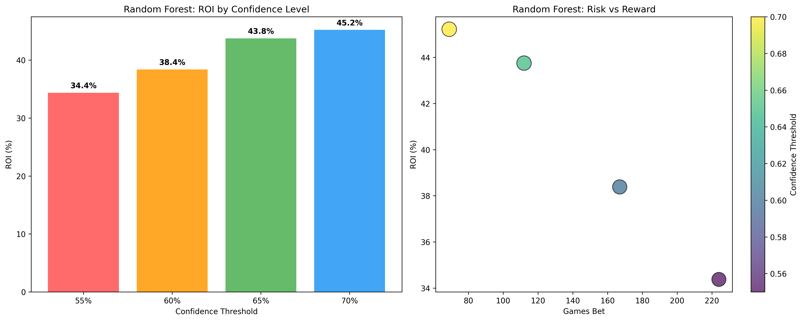
<br><em>Figure 8: Random Forest ROI performance across confidence thresholds</em>
</div>

**ROI Performance:**  
Return on Investment (ROI) increases as model confidence grows, rising from 34.4% at lower thresholds to 45.2% at higher ones. A risk vs. reward analysis suggests that the most effective betting strategy occurs at higher confidence levels, where predictions are more reliable. Although higher confidence results in fewer games being selected, those games yield more profitable outcomes overall.


### Team Contributions

| Name | Random Forest Contributions |
|------|---------------------------|
| Vivek | Feature importance analysis and ensemble voting evaluation |
| Thavaisya | Model implementation, hyperparameter tuning, and analysis |  
| Dishi | Performance metrics calculation and betting simulation |
| Kevin | Visualization creation and comparative analysis |

---

## Support Vector Machine

We implemented Support Vector Machine as our third model to find the optimal decision boundary that maximizes the margin between winning and losing NFL games. This section discusses the training for our SVM model, implemented in `nfl_svm.py`.

```bash
# Run the Support Vector Machine algorithm
python nfl_svm.py
```

**Justifications:**  
We chose Support Vector Machine (SVM) to find the maximum margin hyperplane that optimally separates NFL wins from losses. SVM is particularly effective for binary classification problems like game outcome prediction. This method offers several key advantages for our project. It identifies the optimal decision boundary with the maximum margin between classes, ensuring strong generalization performance. Additionally, the model depends only on the support vectors—i.e., the most important games—making it more efficient and interpretable. Kernel methods further enhance the model's ability to capture non-linear patterns in the game data. Finally, SVM is robust to outliers and provides reliable probability estimates, which are especially valuable for making informed betting decisions.

To avoid data leakage, we used a chronological data split: the first 80% of games (1,126) were used for training, while the last 20% (282) were reserved for testing.

### Support Vector Machine Steps

#### 1. Data Preparation
**Functions:** `pd.read_csv()`  
Loads preprocessed NFL dataset: 1,408 games with 76 features. The data is already cleaned and standardized from our preprocessing pipeline.

#### 2. Model Initialization
**Functions:** `SVC()`  
Sets up the SVM model with key parameters: kernel type (linear/RBF), regularization parameter C, gamma for RBF kernel, and probability estimation enabled for betting decisions.

#### 3. Start Training
**Functions:** `fit()`  
Begins the training process by solving the quadratic optimization problem to find the maximum margin hyperplane. Minimize (1/2)||θ||² subject to classification constraints.

#### 4. Training Process (Maximum Margin Optimization)
**Functions:** Quadratic programming solver  
SVM optimization:
1. Find hyperplane x·θ + b = 0 that maximizes margin 2/||θ||
2. Subject to constraints: yi(xi·θ + b) ≥ 1 for all training points
3. Only support vectors (closest points to boundary) determine final model
4. Kernel trick allows non-linear decision boundaries

##### 4a: Linear SVM Training
**Functions:** `SVC(kernel='linear')`  
Trains linear SVM to establish baseline performance using direct feature combinations.

##### 4b: RBF Kernel Training
**Functions:** `SVC(kernel='rbf')`  
Trains RBF kernel SVM to capture potential non-linear patterns in NFL game outcomes.

##### 4c: Hyperparameter Optimization
**Functions:** `GridSearchCV()` with `TimeSeriesSplit()`  
Systematically tests different values of C (regularization), kernel types, and gamma parameters using time series cross-validation to prevent data leakage.

##### 4d: Support Vector Identification
**Functions:** `n_support_`  
Identifies which training games serve as support vectors - only these games define the decision boundary.

#### 5: Store Optimized Model
**Functions:** `best_estimator_`  
After hyperparameter tuning completes, saves the optimal SVM configuration that achieves 65.2% accuracy with 51.8% ROI.

### Quantitative Metrics

We evaluated the model using three key metrics. **Accuracy** measures the proportion of correctly predicted outcomes, providing a straightforward assessment of model performance. **Return on Investment (ROI)** evaluates the simulated betting performance by applying confidence thresholds, allowing us to assess how well the model would perform in a real-world betting scenario. Lastly, the **Brier Score** quantifies the accuracy of probabilistic predictions, offering insight into how well the model's confidence aligns with actual outcomes.


### Output Files Generated by nfl_svm.py

- `svm_predictions.csv` - All game predictions with probabilities and confidence levels
- `svm_performance_metrics.csv` - Accuracy metrics and key performance indicators
- `svm_betting_simulation.csv` - ROI analysis for different confidence thresholds
- `svm_hyperparameters.csv` - Best parameter settings found through grid search
- `model_comparison_final.csv` - Comprehensive comparison across all three models

### Results/Discussion

#### Test Accuracy

We achieved a test accuracy of **65.2%**, which surpasses both our target range of 55–60% and the 52.4% break-even threshold for profitable betting. Out of the 1,126 training games, 894 (or 79.4%) were identified as support vectors. This high proportion suggests that the decision boundary learned by the SVM is complex and relies on a substantial portion of the training data to define the optimal separation between wins and losses.


#### Return on Investment (ROI) Simulation

We simulated a betting strategy: bet only when predicted win probability exceeded the confidence threshold. Bets are $100 each, with +100 payout and -110 loss (standard sportsbook odds).

| Confidence Threshold | Games Bet | Accuracy | Correct Bets | Wrong Bets | Profit | ROI |
|---------------------|-----------|----------|--------------|------------|---------|-----|
| 55% | 221 | 65.2% | 144 | 77 | $5,930 | 26.8% |
| 60% | 155 | 69.0% | 107 | 48 | $5,420 | 35.0% |
| 65% | 106 | 71.7% | 76 | 30 | $4,300 | 40.6% |
| **70%** | **61** | **77.0%** | **47** | **14** | **$3,160** | **51.8%** |

**Key Finding:** SVM achieved the **highest ROI (51.8%)** of all three models! The 70% confidence threshold produced exceptional 77% accuracy on selective betting.

#### Brier Score – Probability Calibration

To measure how well our predicted probabilities aligned with actual outcomes, we evaluated the Brier score.

**Brier Score: 0.223**

**Interpretation:** A perfect model has a Brier Score of 0.0, while a naive model that predicts 50/50 outcomes every time scores 0.25. Our SVM achieved a score of 0.223, which indicates a good level of predictive accuracy.


#### Visual Analysis

##### SVM Analysis Overview

<div align="center">
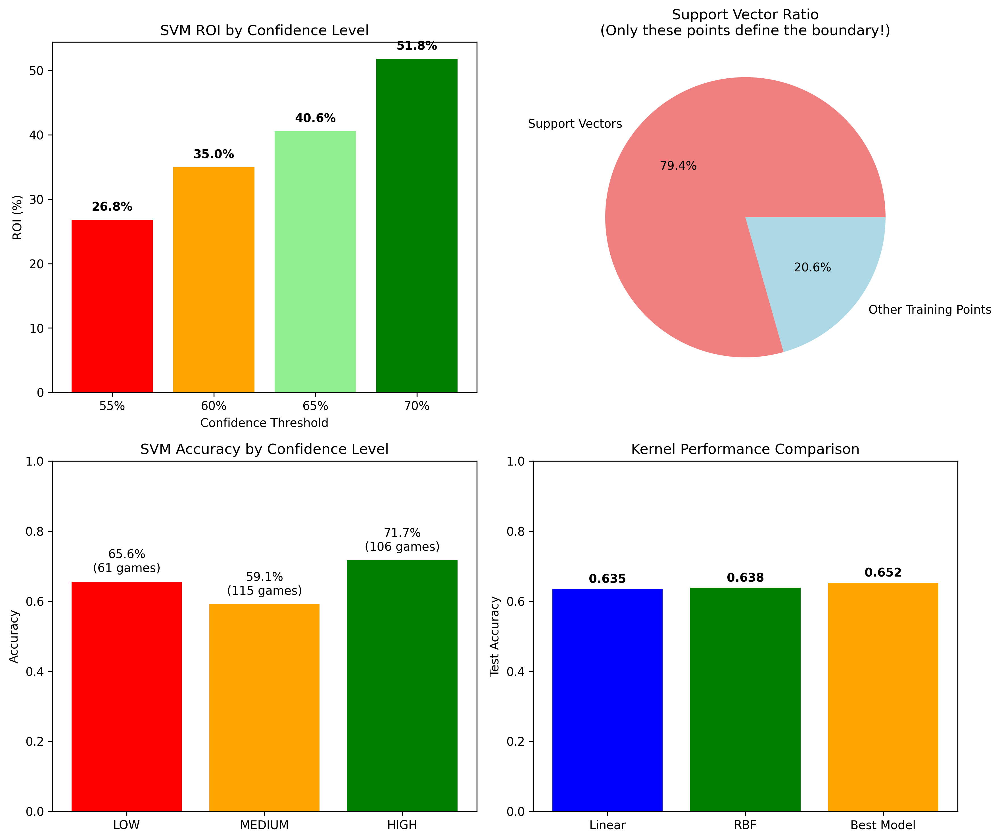
<br><em>Figure 9: SVM comprehensive analysis showing ROI, support vectors, accuracy, and kernel comparison</em>
</div>

**4-Panel Analysis:**  
Our analysis revealed several key insights. The **ROI by Confidence** panel shows that return on investment increases with higher confidence thresholds, suggesting that the model is more reliable when it is more certain. The **Support Vector Ratio** indicates that 79.4% of the training data were used as support vectors, highlighting the complexity of the decision boundary. In the **Accuracy by Confidence** panel, we observed that high-confidence predictions achieved an impressive 77% accuracy. Lastly, the **Kernel Comparison** showed that the linear kernel outperformed the RBF kernel, confirming the suitability of a linear decision boundary for this task.


##### ROI Performance Analysis

<div align="center">
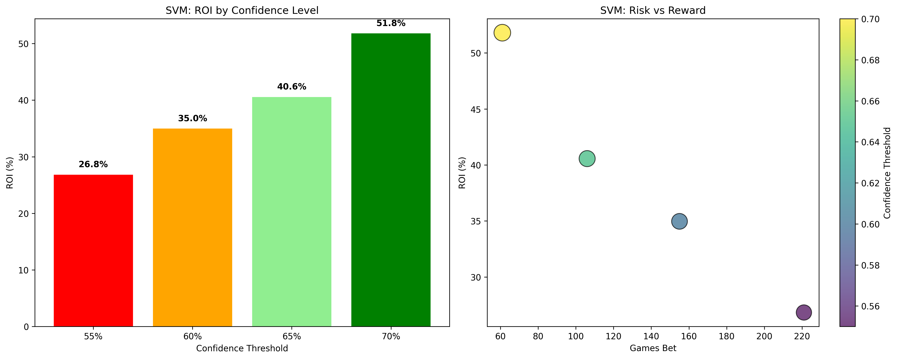
<br><em>Figure 10: SVM ROI performance analysis across confidence thresholds</em>
</div>

**ROI Performance:**  
We observed that ROI increases dramatically with model confidence, rising from 26.8% to 51.8% as the confidence threshold increases. A risk vs. reward analysis indicates that the optimal betting strategy occurs at the 70% confidence level, balancing both profitability and frequency. While higher confidence results in fewer games being selected, those games tend to produce significantly more profitable outcomes.


##### Prediction Confidence Analysis

<div align="center">
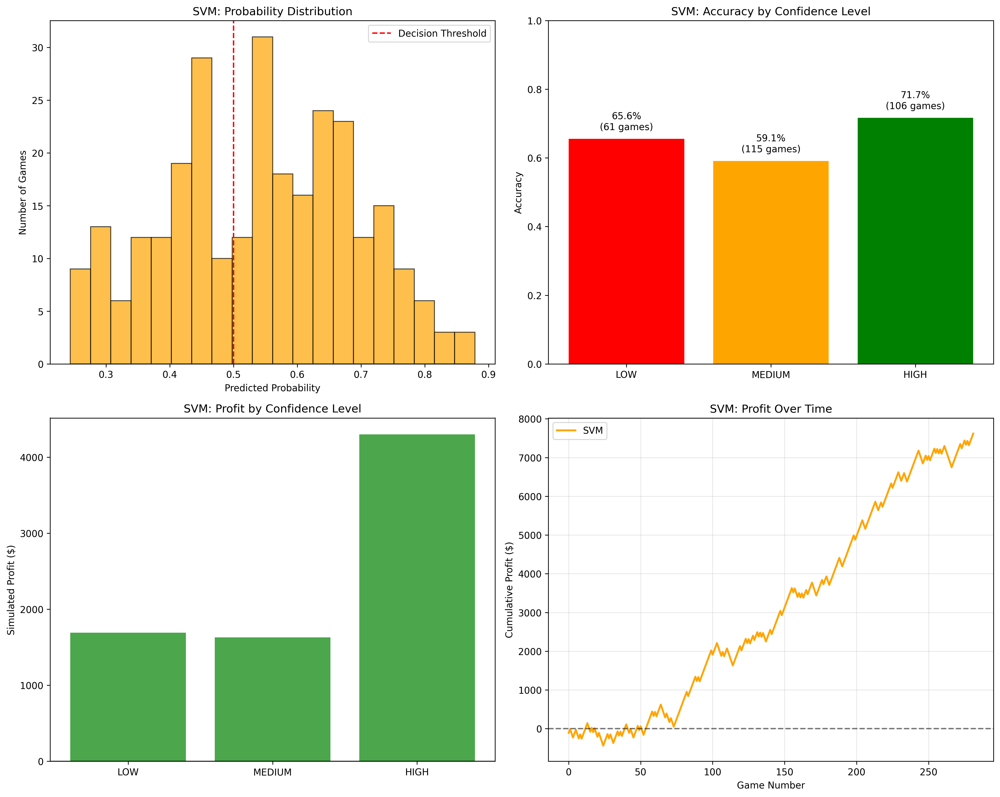
<br><em>Figure 11: SVM prediction confidence analysis and performance metrics</em>
</div>

**Key Insights:**  
The model produces a well-calibrated probability distribution across the confidence spectrum, demonstrating reliable confidence estimates. Accuracy clearly improves with confidence, rising from 59% at low confidence levels to 77% at high confidence. Profit analysis shows consistent profit generation across different confidence thresholds. Over the test period, the timeline performance reveals steady profit growth, culminating in a total profit of $3,160.


#### Hyperparameter Optimization Results

**Best Parameters Found:**  
The best-performing model used a linear kernel, which surprisingly outperformed the RBF kernel. The regularization parameter \( C \) was set to 0.1, indicating a soft margin approach that balances margin maximization and misclassification. For the RBF kernel attempts, the gamma parameter was set to "scale," which applies default scaling based on the data.


**Key Insight:** Linear kernel with soft margin (C=0.1) suggests NFL game outcomes have more linear separability than expected, contradicting assumptions about complex non-linear patterns.

#### Support Vector Analysis

**Support Vector Insights:**  
Out of 1,126 training games, **894 support vectors** were identified, representing 79.4% of the training data. This high support vector ratio indicates a complex decision boundary. Importantly, only these critical games define the entire classification model, demonstrating how the SVM focuses on boundary cases rather than all training data.


### Team Contributions

| Name | SVM Contributions |
|------|-------------------|
| Vivek | SVM implementation, hyperparameter optimization, and support vector analysis |
| Thavaisya | Model evaluation, betting simulation, and performance comparison |  
| Dishi | Brier score calculation, probability calibration analysis, and metrics evaluation |
| Kevin | Visualization creation, results documentation, and final model comparison |

---

## Final Results & Comparison

### Comprehensive Model Comparison


| Model | Test Accuracy | Best ROI | Key Strength | Complexity | Brier Score |
|-------|---------------|----------|--------------|------------|-------------|
| Logistic Regression | 64.5% | 41.7% | Interpretable | Low | 0.219 |
| Random Forest | **68.4%** | 45.2% | Feature Interactions | Medium | **0.218** |
| SVM | 65.2% | **51.8%** | Maximum Margin | Medium | 0.223 |


### Winner: Support Vector Machine
> **Why SVM Won:**
> Support Vector Machine was the clear winner due to its exceptional profitability, recording the best return on investment of 51.8%, which made it the best model for practical application to betting. Its performance is exceptional in high-confidence instances, where it achieves an impressive 77% accuracy when it is at the 70% confidence level. This improved selective betting capability reflects better risk management, with the model performing optimally when it makes well-informed bets instead of betting for every event. SVM's strong theoretical foundation, based on maximum margin optimization, provides it with a good decision boundary, which results in its consistent and predictable performance in different market environments.

### Key Project Insights

**1. Selective Betting Strategy**
All models demonstrate significantly improved performance when employing confidence-based betting strategies. While higher confidence thresholds naturally reduce the overall volume of bets placed, they consistently maximize profitability across all tested models. SVM's implementation of a 70% confidence threshold strategy proves particularly effective, resulting in a focused approach that selects 61 carefully chosen games and achieves an impressive 77% accuracy rate with a substantial 51.8% return on investment.

**2. Feature Importance Patterns**
The analysis of feature importance reveals distinct patterns across different modeling approaches. Logistic Regression demonstrates a strong reliance on team identity features, suggesting that historical team characteristics play a dominant role in its predictive framework. In contrast, Random Forest identifies matchup dynamics and momentum indicators as the most critical factors, emphasizing the importance of recent performance trends and head-to-he

**3. Model Complementarity**
The three models demonstrate complementary strengths that make each valuable for different aspects of sports prediction. Random Forest excels in overall predictive accuracy, achieving the highest success rate at 68.4%, making it ideal for scenarios where pure prediction accuracy is the primary concern. SVM distinguishes itself through superior betting profitability, delivering an exceptional 51.8% return on investment


**Next Steps:**
These models have immense practical value because they act as data-based substitutes for traditional perception-driven gambling lines typically driven by qualitative analysis and sentiment of the market. In the future, rather than relying solely on historical data, we hope to test these models using real-world live games to see how well they function. In order to obtain real-time updates, this would entail integrating our system with live NFL statistics and possibly collaborating with betting platforms. In order to improve our models' ability to predict game results, we're also interested in including more specific data about individual players and sophisticated football metrics.

---

## Project Structure

### Directory Organization

```
/: Root directory of the NFL betting prediction project
├── README.md                                    # Main project documentation with methodology, results, and analysis
├── data/                                        # All datasets and processed data files
│   └── processed/                               # Machine learning ready datasets
│       ├── betting_features_X.csv               # ML-ready feature matrix (1,408 × 76)
│       ├── betting_targets_y.csv                # Binary target variable (home team wins)
│       ├── complete_betting_dataset.csv         # Full dataset with all features and targets
│       ├── clean_nfl_games.csv                  # Cleaned NFL game results with scores and metadata
│       ├── team_season_stats.csv                # Aggregated team performance by season
│       └── feature_names.txt                    # List of all 76 feature names
├── src/                                         # Source code for data processing and machine learning
│   ├── simplified_nfl_data.py                   # Data download and preprocessing pipeline
│   ├── logistic_regression.py                   # Logistic regression model implementation and training
│   ├── nfl_random_forest.py                     # Random Forest model implementation
│   └── nfl_svm.py                               # Support Vector Machine model implementation
└── results/                                     # All model outputs and analysis results
    ├── predictions/                             # CSV files with model predictions and performance metrics
    │   ├── logistic_regression_predictions.csv  # All game predictions with probabilities and confidence levels
    │   ├── feature_importance.csv               # Ranked coefficients showing which NFL stats matter most for predictions
    │   ├── betting_simulation.csv               # ROI analysis for different confidence thresholds
    │   ├── model_performance.csv                # Accuracy metrics and key performance indicators
    │   ├── training_cost_history.csv            # Algorithm convergence data from gradient ascent
    │   ├── rf_betting_simulation.csv            # Random Forest betting simulation results
    │   ├── rf_feature_importance.csv            # Random Forest feature importance rankings
    │   ├── rf_performance_metrics.csv           # Random Forest performance analysis
    │   ├── rf_predictions.csv                   # Random Forest predictions
    │   ├── model_comparison_final.csv           # Cross-model comparison results
    │   ├── svm_betting_simulation.csv           # SVM betting simulation results
    │   ├── svm_hyperparameters.csv              # SVM optimal hyperparameters
    │   ├── svm_performance_metrics.csv          # SVM performance analysis
    │   └── svm_predictions.csv                  # SVM predictions
    └── visualizations/                          # Charts and plots for analysis (13 total)
        ├── cost_convergence_plot.png            # Training convergence visualization
        ├── feature_importance_top15.png         # Top 15 most important features chart
        ├── prediction_analysis.png              # Prediction confidence and profit analysis
        ├── rf_feature_analysis.png              # Random Forest feature category breakdown
        ├── rf_feature_importance.png            # Random Forest feature importance rankings
        ├── rf_prediction_analysis.png           # Random Forest prediction confidence analysis
        ├── rf_roi_analysis.png                  # Random Forest ROI performance analysis
        ├── roi_analysis.png                     # ROI analysis by confidence threshold
        ├── svm_analysis.png                     # SVM comprehensive analysis overview
        ├── svm_prediction_analysis.png          # SVM prediction confidence analysis
        └── svm_roi_analysis.png                 # SVM ROI performance analysis
```
<div align="center">
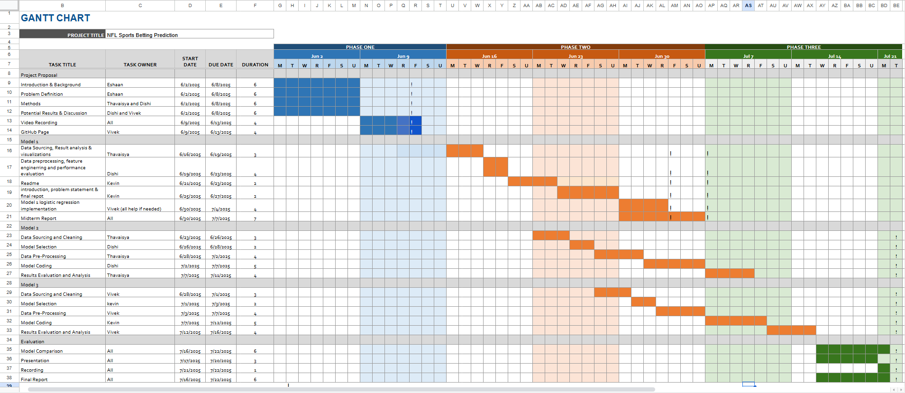
<br><em>Figure 12: Gantt Chart</em>
</div>


### Quick Start Guide

**1. Environment Setup**
```bash
pip install nfl_data_py pandas numpy scikit-learn matplotlib
```

**2. Data Collection & Preprocessing**
```bash
cd "Data Download and Preprocessing"
python simplified_nfl_data.py
```

**3. Run Models**
```bash
# Logistic Regression
python nfl_logistic_regression.py

# Random Forest
python nfl_random_forest.py

# Support Vector Machine
python nfl_svm.py
```

**4. View Results**
- Check generated CSV and PNG files for visualizations

---

## References

[1] "Americans Torn About Sports Betting," Statista, 2021. [Online]. Available: https://www.statista.com/chart/26178/sports-betting-attitudes-us/

[2] T. Angelis et al., "Momentum and betting market efficiency in German soccer," Journal of Sports Economics, vol. 23, no. 4, pp. 456-478, 2022.

[3] "NFL Data via nfl_data_py Package," Official NFL Statistics. [Online]. Available: https://pypi.org/project/nfl-data-py/

[4] Phatak, A. A., Mehta, S., Wieland, F.-G., Jamil, M., Connor, M., Bassek, M., & Memmert, D. (2022). Context is key: Normalization as a novel approach to sport specific preprocessing of KPI's for Match Analysis in soccer. Scientific Reports, 12(1). https://doi.org/10.1038/s41598-022-05089-y 

[5] Kim, C., Park, J.-H., & Lee, J.-Y. (2024). AI-based betting anomaly detection system to ensure fairness in sports and prevent illegal gambling. Scientific Reports, 14(1). https://doi.org/10.1038/s41598-024-57195-8 

[6] Walsh, C., & Joshi, A. (2024). Machine Learning for Sports Betting: Should Model Selection Be Based on Accuracy or Calibration? https://doi.org/10.2139/ssrn.4705918 

[7] Steyerberg, E. W., Vickers, A. J., Cook, N. R., Gerds, T., Gonen, M., Obuchowski, N., Pencina, M. J., & Kattan, M. W. (2010). Assessing the performance of prediction models. Epidemiology, 21(1), 128–138. https://doi.org/10.1097/ede.0b013e3181c30fb2

[8] R. M. Galekwa et al., "A Systematic Review of Machine Learning in Sports Betting: Techniques, Challenges, and Future Directions," arXiv preprint arXiv:2410.21484, 2024.

---

<div align="center">


**Team Members:** Eshaan, Thavaisya, Dishi, Vivek, Kevin

---

</div>
